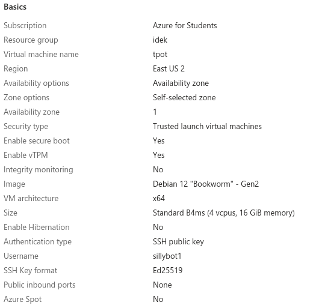
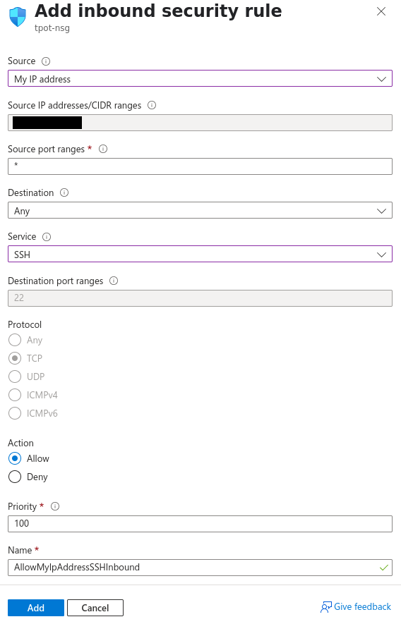
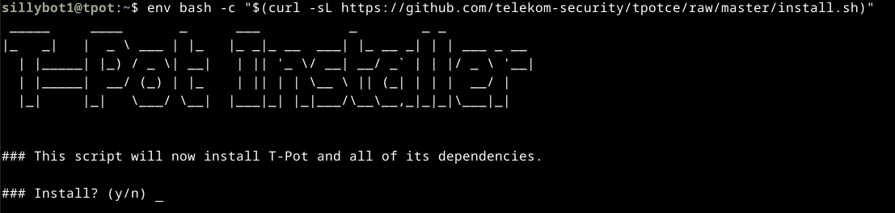
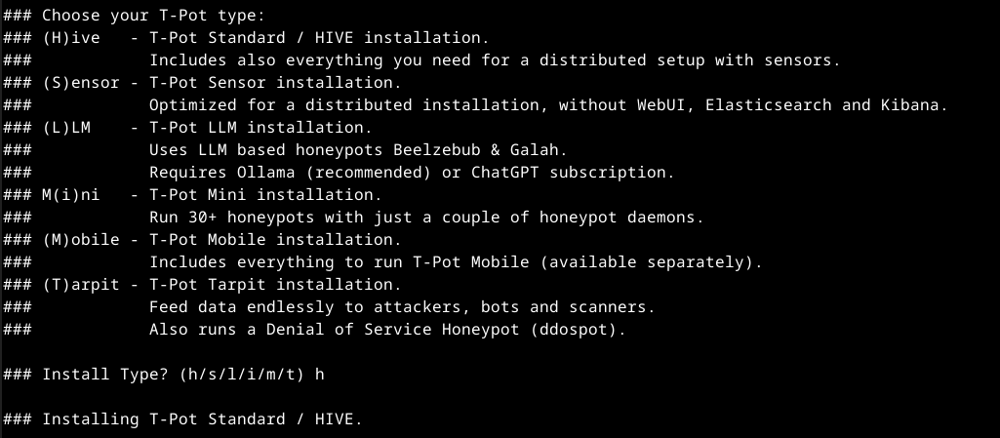
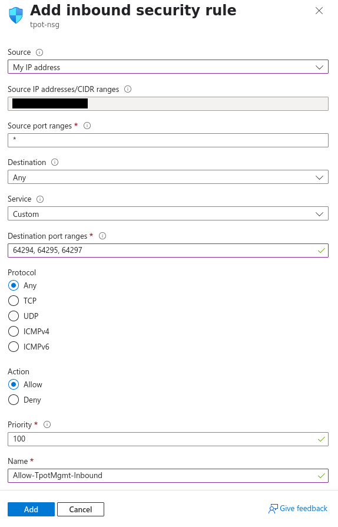
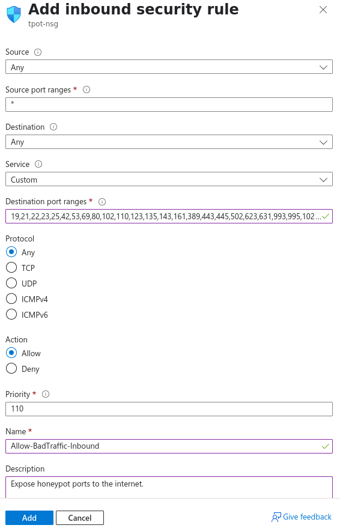

A simple guide for setting up Telekom's awesome multi-honeypot [T-Pot](https://github.com/telekom-security/tpotce) on Azure.

## Azure VM Deployment 

---

Create a resource > select `Ubuntu Server 24.04 LTS` or `Debian 12 "Bookworm"`
- <b>Note:</b> Ubuntu was less problematic (T-Pot installs flawlessly out of the box), but Debian is slimmer and slightly more performant. I chose Debian for this tutorial, but most steps should apply to both.

#### Basics

    Virtual Machine Name:    tpot
    Region:                  East US 2
    Availibility Zone:       1
    Image:                   Debian 12 "Bookworm" - Gen2
    VM architecture:         x64
    Size:                    Standard B4ms (4 vcpus, 16 GiB memory)
    Authentication type:     SSH public key
    Public inbound ports:    none

- <b>Note:</b> You can allow immediate remote access via port 22 during this setup, but this port will be exposed to ALL external IPs. For this reason, I suggest setting 'Public inbound ports' to None and then creating a more restricted, temporary NSG rule after deploying the VM (see [Install step #1](#installing-t-pot)).

#### Disks

    OS Disk size:      128 GiB
    OS Disk type:      Standard SSD LRS
    Delete with VM:    Enabled

#### Networking

    Virtual network:            tpot-vnet
    Subnet: default             (10.0.0.0/24)
    Public IP:                  tpot-ip
    Accelerated networking:     On
    Delete with VM:             Enabled

- <b>Note:</b> T-Pot expects your virtual network subnet (internal) to be a /24 (255.255.255.0) 

## Installing T-Pot 

1. Create temporary SSH firewall rule (VM > Side Panel > Networking > Settings > (+) Create Port Rule > Inbound)

3. SSH into the VM
4. Follow the [quick installation steps](https://github.com/telekom-security/tpotce#tldr) listed on the official repo

- <b>Note:</b> If unattended-upgrades.service is running (check with `sudo systemctl status unattended-upgrades.service`), you may need to stop it temporarily to avoid 'dpkg frontend lock' errors: `sudo systemctl stop unattended-upgrades.service`

 

#### During install:
- T-Pot install type: 'h'

- Document your chosen web username/password. You will need this to login to the T-Pot Web Dashboard.
- Even though Azure NSG rules restrict access, make sure to have a strong web user password (e.g. 30+ char alhpa-numeric).

## System Tweaks

    $ nano /etc/ssh/sshd_config
    change: PasswordAuthentication {} --> PasswordAuthentication no

    $ sudo apt install unattended-upgrades
    $ sudo systemctl enable --now unattended-upgrades.service
    
    $ sudo crontab -e
    # cleanup
    0 2 * * 0 apt autoremove --purge && apt autoclean -y

    (if your VM has exim4 installed, it will compete with some of the honeypots for port 25)
    $ sudo systemctl disable --now exim4-base.timer exim4-base.service exim4.service
    $ sudo apt purge exim4*

## NSG Firewall Rules

- Delete the temporary SSH rule created for initial access

#### Inbound:

    Source: My IP address
    Source IP addresses/CIDR ranges: {your public IP}
    Source port ranges: *
    Destination: Any
    Service: Custom
    Destination port ranges: 64294, 64295, 64297
    Protocol: Any
    Action: Allow
    Priority: 100
    Name: Allow-TpotMgmt-Inbound
    Description: Allow SSH and Web Dashboard access from My IP.

    Source: My IP address
    Source IP addresses/CIDR ranges: {your public IP}
    Source port ranges: *
    Destination: Any
    Service: Custom
    Destination port ranges: 19,21,22,23,25,42,53,69,80,102,110,123,135,143,161,389,443,445,502,623,631,993,995,1025,1080,1433,1521,1723,1883,1900,2404,2575,3000,3306,3389,5000,5060,5432,5555,5900,6379,6667,8080,8081,8090,8443,9100,9200,10001,11112,11211,25565,44818,47808,50100
    Protocol: Any
    Action: Allow
    Priority: 110
    Name: Allow-BadTraffic-Inbound
    Description: Expose honeypot ports to the internet.

#### Outbound:

    Source: Any
    Source port ranges: *
    Destination: Any
    Service: Custom
    Destination port ranges: 80, 443, 11434
    Protocol: Any
    Action: Allow
    Priority: 120
    Name: Allow-TpotMgmt-Outbound
    Description: Allow outbound management traffic.

## Test Access

<b>SSH:</b> ssh {username}@{Azure VM Public IP} -p 64295

<b>Web Dashboard:</b> https://{Azure VM Public IP}:64297 (bookmark this)

#### Kibana

#### Attack Map

#### [Spiderfoot](https://github.com/smicallef/spiderfoot) Threat Intelligence

## Configuring Elasticsearch/Logstash

😴😴😴

## Troubleshooting

#### Changing the T-Pot Web UI Password:
- `htpasswd /home/<local user>/tpotce/data/nginx/conf/nginxpasswd <web username>`
- Verify: `htpasswd -v nginxpasswd <web username>` 

 

#### Creating a New Web User:
- `/home/<local user>/tpotce/genuser.sh`
- `htpasswd /home/<local user>/tpotce/data/nginx/conf/nginxpasswd <new user>`
- Verify: `cat /home/<local user>/tpotce/data/nginx/conf/nginxpasswd` to make sure there is an entry for <new user>

 

#### To check for TPot-related errors:
- `journalctl -u tpot -f` 

 

#### To check the status/errors of tpot.service:
- `sudo systemctl status tpot.service` 

 

#### To check for port bind conflicts that will force-restart tpot.service:
- `sudo netstat -tulpen` or `sudo ss -tunlap` 

 

#### To determine processes reponsible for port conflicts on a specified port:
- `sudo fuser {port}/tcp(udp)` to get the PID(s) of processes using this port, then `ps -p {PID}` 

 

#### You may need to manually set DNS/nameservers in case of port 53 conflict: 
        
        $ sudo systemctl disable --now systemd-resolved.service
  
        $ sudo nano /etc/resolve.conf
  
        127.0.0.1 {hostname}
        nameserver 8.8.8.8
        nameserver 8.8.4.4
 
