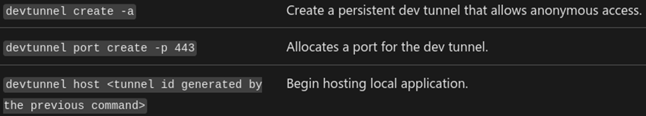

  
## Targeted Entities
---
This campaign does not target any specific industry and has been observed attacking a wide variety of individuals and organizations. However, the malware utilized by this campaign (njRAT) was found to have originated in the Middle East and is primarily used to target Arabic-speaking countries [1][7]. 

## Introduction
---
Part of the Microsoft Azure official toolkit and used by developers to test apps and sync local testing environments securely over the internet, the ‘dev tunnels’ service has made a surprising appearance in a recent threat campaign leveraging a new variant of the popular njRAT Remote Access Trojan [9]. A blog post published on the SANS Internet Storm Center by security researcher Xavier Mertens (@xme) announced the discovery of the malware, highlighting its creative use of Microsoft's dev tunnels for communication between infected devices and identified command-and-control (C2) servers [8]. 

Mertens says he spotted this strain of njRAT sending continuous status updates to C2 servers via dev tunnel URLs. A deeper analysis of captured samples revealed hardcoded server listening ports, the suspected botnet name, client version and capabilities of the malware [8]. 

###### Reconstructed code showing client connection initiation, ‘OK.HH’ stores a dev tunnel URL (Source: SANS Internet Storm Center) 

###### JSON extraction of recent njRAT sample (Source: SANS Internet Storm Center) 

In his findings, he also discusses the ability of this malware to detect and propagate to external hard drives via USB. Shown in the code snippet below, if the ‘OK.usb’ variable is set to True, the malware will attempt to copy itself to any mounted USB devices [8]. 

###### Reconstructed code showing USB propagation ability (Source: SANS Internet Storm Center) 

## Background 
---
First observed in 2012, njRAT has become one of the most widely accessible Remote Access Trojan (RATs) on the market. It features an abundance of educational information with many tutorials available online [1]. This, combined with its open-source nature, has ranked it among the most popular RATs in the world. According to ANY.RUN, a prominent online malware analysis service, the njRAT malware family currently holds the #2 spot for all time total submission count [3]. Though historically used for browser cookie and credential theft, njRAT boasts a wide range of capabilities including keylogging, webcam/screen recording, cryptocurrency theft and wallet enumeration, registry modifications, file uploads, and USB drive propagation [7]. 

The use of legitimate services to mask command and control communication and data exfiltration, often called ‘C2 tunneling’, is hardly a novel concept. Cloudflare Tunnel (cloudflared), ngrok, and the DNS protocol, have and continue to be exploited by bad actors to conceal this malicious network activity [6]. Interestingly, previous njRAT campaigns have also abused services like Pastebin for C2 tunneling, only this time, there is the added certificate authority trust inherited by routing traffic through Microsoft’s Azure infrastructure [5]. However, the use of dev tunnels for stealth data exfiltration has existed as a proof of concept as early as 2023, when the tool was first released alongside Visual Studio 2022 v17.6 [4][10]. 

The setup of dev tunnels for C2 redirection is a relatively straightforward process. The threat actor needs only a valid GitHub or Microsoft account and the free executable available on Windows, MacOS, and Linux [11]. With that, they would need to authenticate via the tool with one of the following commands: 

 
######

After verification, a secure, persistent channel can be deployed by issuing the following:

 
######

With the dev tunnel active, all the attacker has to do is bind the channel to their C2 listener port on the same host machine [4]. Now, the control server and infected devices will direct all C2 traffic through a trusted proxy hosted within Microsoft’s Azure cloud infrastructure. 

It is worth noting that regardless of the actual traffic direction or protocol being used, the tunnel always presents itself to the victim’s network as outbound TLS traffic. This means that even when an adversary is actively connecting inbound to a victim’s system, the connection appears in network logs and monitoring tools as a standard outbound HTTPS connection originating from the victim’s network [11]. 

## MITRE ATT&CK 
---
#### S0385 - njRAT 
This campaign utilizes a variant of the njRAT Remote Access Trojan. 

#### TA0011 - Command and Control (C2) 
Following system infection, njRAT will contact a control server awaiting instructions from an attacker. It can be configured to choose from a list of attacker-owned servers. 

#### T1572 - Protocol Tunneling 
Using the Microsoft dev tunnel service, infected system outreach, data exfiltration, and malicious commands from the control server occur over disposable, encrypted channels, making it harder for traditional security systems to spot and implement effective preventions. 

#### T1547.001 - Registry Run Keys / Startup Folder 
On infected Windows systems, this variation of njRAT creates a registry value entry under the ‘Software\\Microsoft\\Windows\\CurrentVersion\\Run\\’ key path. To achieve persistence across reboots, the malicious program references itself using this “run key", executing each time a user logs in. 

#### T1082 - System Information Discovery 
The malware performs enumeration of the infected host. It checks the OS version, supported languages, hostname, registry GUID, and other information that is then sent to the control server [2]. 

#### T1091 - Replication Through Removable Media 
njRAT will attempt to detect any removable drives connected to the system. If found, the malware will create a standalone copy of itself to that drive. 

## Indicators of Compromise (IOCs) 
--- 
#### SHA-256 Hashes 
	0b0c8fb59db1c32ed9d435abb0f7e2e8c3365325d59b1f3feeba62b7dc0143ee 
	9ea760274186449a60f2b663f535c4fbbefa74bc050df07614150e8321eccdb7 
	cb2d8470a77930221f23415a57bc5d6901b89de6c091a3cfbc563e4bf0e7b4eb 
	c0513783d569051bdc230587729b1da881f7032c2ad6e8fedbbdcc61d813da25 

#### Associated Filenames 
	dsadasfjamsdf.exe 
	c3df7e844033ec8845b244241c198fcc.exe 

#### Registry Key
	Software\\Microsoft\\Windows\\CurrentVersion\\Run\\af63c521a8fa69a8f1d113eb79855a75 

#### IP Addresses
	20.103.221[.]187 

#### C2 URLs 
	hxxps://nbw49tk2-27602.euw.devtunnels[.]ms/ 
	hxxps://nbw49tk2-25505.euw.devtunnels[.]ms/ 

#### Dev Tunnel Domain Formats 
	global.rel.tunnels.api.visualstudio.com 
	[clusterId].rel.tunnels.api.visualstudio.com 
	[clusterId]-data.rel.tunnels.api.visualstudio.com 
	*.[clusterId].devtunnels.ms 
	*.devtunnels.ms 

## Recommendations 
---
#### Monitor DNS Traffic for Dev Tunnel URLs  
Organizations not using dev tunnels should keep an eye on DNS logs for any unexpected dev tunnel URLs (typically ending in “.devtunnels.ms”) that may indicate potential C2 communication [5]. IDS/IPS rules should be applied to automatically alert or block this traffic. 

#### Beware of USB Devices  
This variant, as well as previous versions of njRAT, has the ability to detect and spread to external hard drives connected via USB. Users should exercise caution when interacting with unknown USB devices. For critical systems, it may also be advised to locally disable the use of external storage hardware. 

#### Use EDR/Host-Based IDS  
The malware’s use of dev tunnels can blend its traffic with normal activity, rendering network intrusion detection efforts less effective. Configuring endpoint protection solutions to detect and flag the use of Microsoft-signed binaries (e.g., devtunnel.exe) by anomalous parent processes or modifications to the auto-run registry can offer another layer of defense to address this gap [5]. 

#### Network Segmentation  
Botnet malware like njRAT spreads primarily via ‘spray and pray' orchestration, typically infecting internet-facing devices that lack proper security controls. IoT devices, poorly configured web servers, and routers with deprecated firmware make up a sizable portion of modern botnet infrastructure. If security patches or hardening cannot be applied to such systems, isolating them from the main home or enterprise network is imperative to prevent lateral movement to critical systems. 

#### Stay Informed on the Latest TTPs  
As threat actors become more innovative in their detection evasion and exfiltration techniques, security analysts must remain up to speed with the ongoing changes of an evolving threat landscape. 

## References 
---
[1] ANY.RUN. (March 9, 2025). NJRAT. https://any.run/malware-trends/njrat 

[2] ANY.RUN. (February 27, 2025). dsadasfjamsdf.exe Sandbox Analysis. https://app.any.run/tasks/c01ea110-ecbf-483a-8b0f-d777e255ad9c 

[3] ANY.RUN. (March 9, 2025). Malware Trends Tracker. https://any.run/malware-trends/ 

[4] Au, C. (August 9, 2023). Microsoft Dev Tunnels as C2 Channel. https://www.netero1010-securitylab.com/red-team/microsoft-dev-tunnels-as-c2-channel 

[5] Baran, G. (February 28, 2025). Njrat Attacking Users Abusing Microsoft Dev Tunnels for C2 Communications. https://cybersecuritynews.com/njrat-attacking-abusing-microsoft-dev/ 

[6] BlueteamOps. (Oct 23, 2023). Detecting ‘Dev Tunnels.’ https://detect.fyi/detecting-dev-tunnels-16f0994dc3e2 

[7] Check Point. (August 15, 2023). What is NJRat Malware? https://www.checkpoint.com/cyber-hub/threat-prevention/what-is-malware/what-is-njrat-malware/ 

[8] Mertens, X. (February 27, 2025). Njrat Campaign Using Microsoft Dev Tunnels. https://isc.sans.edu/diary/Njrat%20Campaign%20Using%20Microsoft%20Dev%20Tunnels/31724 

[9] Microsoft. (November 17, 2023). What are dev tunnels? https://learn.microsoft.com/en-us/azure/developer/dev-tunnels/overview 

[10] Montemagno, J. (February 5, 2024) Dev Tunnels: A Game Changer for Mobile Developers. https://devblogs.microsoft.com/dotnet/dev-tunnels-a-game-changer-for-mobile-developers/ 

[11] Rossouw, F. (December 5, 2024). Malware of the Day – Tunneling Havoc C2 with Microsoft Dev Tunnels. https://www.activecountermeasures.com/malware-of-the-day-tunneling-havoc-c2-with-microsoft-dev-tunnels/ 

 
