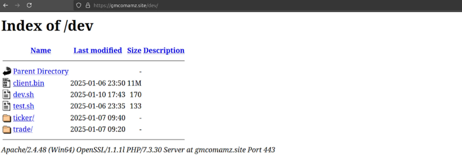
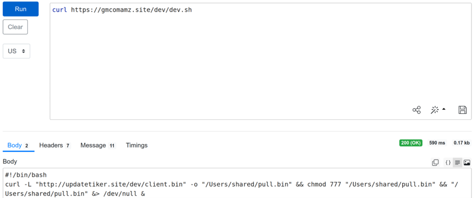
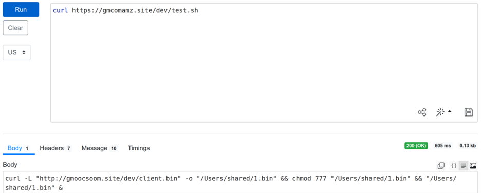
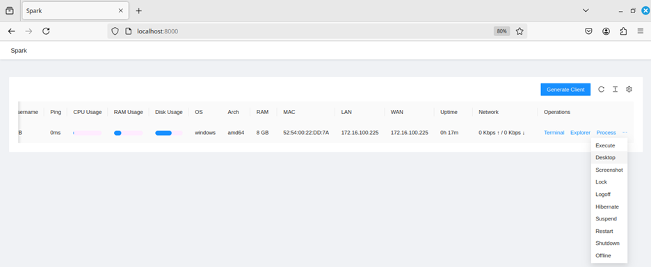
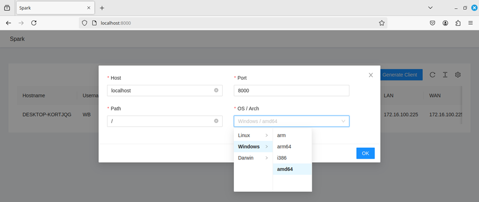
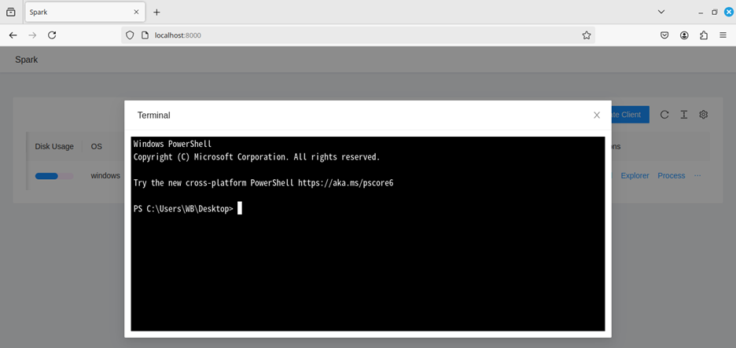
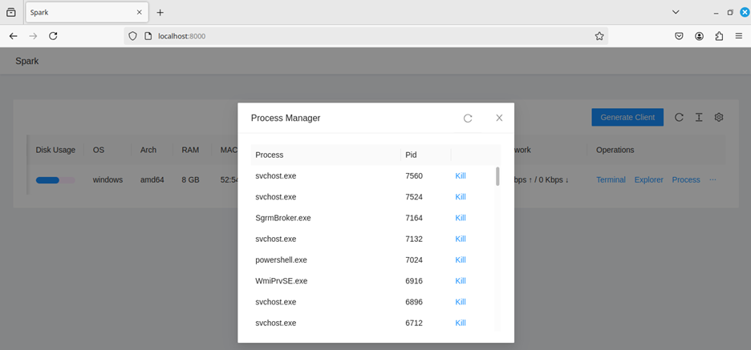
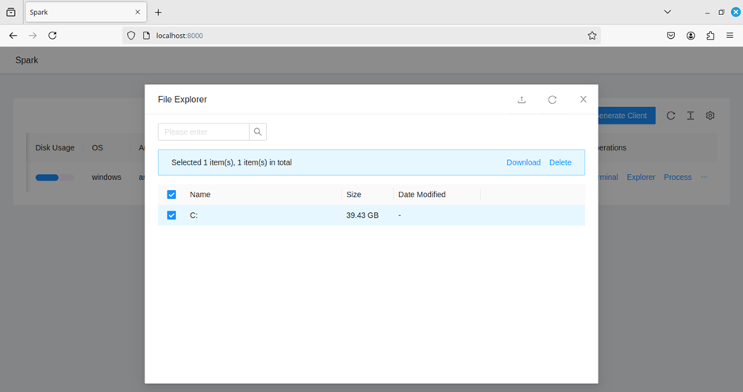
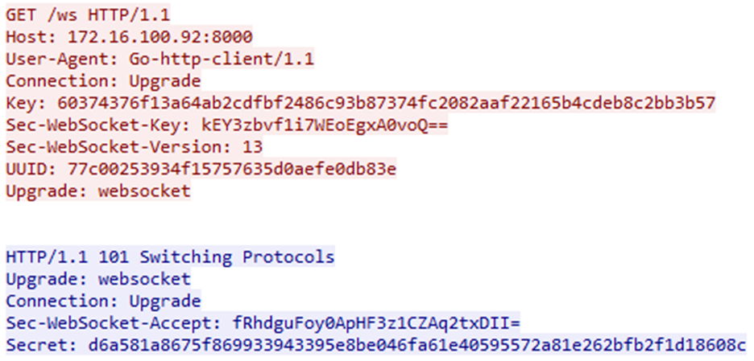
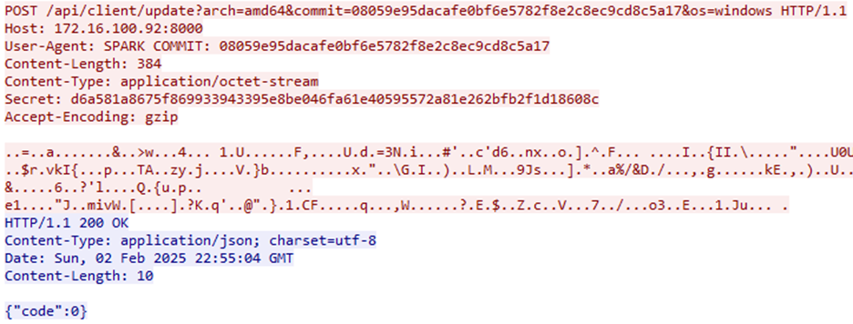

## Targeted Entities
---
- Industries: Any (Opportunistic) 
- Operating Systems: Windows, macOS, and Linux 

  

## Introduction
---
Written primarily in Golang, SparkRAT is a feature-rich, multi-platform Remote Administration Tool (RAT)
that allows for the granular control of infected devices via web interface [11]. It was first published
on GitHub in March of 2022 by elusive, Chinese-speaking developer XZB-1248. However, the project went
largely unnoticed until gaining steady popularity in early 2023. Since then, the tool has been observed
in numerous threat campaigns, including those carried out by cybercriminal groups Winnti and DragonSpark,
as well as its involvement in the Hello Kitty and TellYouThePass ransomware attacks [6]. 

Like most Remote Access Toolkits, SparkRAT has been widely leveraged by threat actors for post-exploitation
operations, typically being installed after the payload delivery and initial compromise. Most notably, the
tool has been used in conjunction with several critical vulnerability exploits: CVE-2023-46604, CVE-2024-27198,
and CVE-2024-43451 [1][3][4]. After a period of dormancy, SparkRAT resurfaced in January, with security
researchers at Hunt.io detecting new C2 servers and hints of a possible DPRK campaign targeting macOS users [7]. 

  

## SparkRAT Observed in DPRK Campaign
---
In a Twitter post by threat intelligence expert, Germán Fernández (@1ZRR4H) back in November 2024,
a cyber espionage campaign attributed to the North Korean government was revealed, targeting macOS
users and government organizations [5]. The threat actors behind this operation were reportedly
distributing SparkRAT agents via fake online meeting platforms. Upon further investigation,
researchers at Hunt.io and Cato Networks have recently identified additional C2 servers in South
Korea and Singapore [2]. The findings suggest that this campaign is still active, although
with a slight change in strategy and payload delivery method. 

Interestingly, these uncovered C2 server domains were found to have open directories
containing SparkRAT implants and bash scripts. Below are screenshots of an exposed directory and the content of its hosted scripts. 

###### Screenshot of hxxps://gmcomamz[.]site/dev (Source: Hunt.io)

<h6>Curl results from hxxps://gmcomamz[.]site/dev/dev.sh</h6>

The bash script above downloads the Mach-O binary file (client.bin) from the hosting domain
(updatetiker[.]site), saves it as “pull.bin” to the /Users/shared directory, changes its
permissions to allow reading, writing, and execution by all system users, and runs the file
as a background process. This is typical behavior of malware hosting servers. 

The behavior of the test.sh script is similar, however, it points to
another domain which has also been found to host SparkRAT agents (clients): 

<h6>Curl results from hxxps://gmcomamz[.]site/dev/test.sh</h6>

## SparkRAT Analysis
---

<h6>SparkRAT Web Interface</h6>

Accessed through a browser, the SparkRAT Web UI provides an overview of active remote sessions along with
system information of each connected machine. In addition to the basic operations listed below, the tool’s
interface comes with several additional capabilities such as viewing a live instance of the victim’s screen, taking screenshots, and remote shutdown. 

<h6>Client Creation</h6>

**Generate Client** creates an executable file that, when executed on a target machine,
will create a backdoor connection with the associated C2 system. Clients can be customized
to point to different hosts, connect over a specified port, and run on different operating
systems (Windows, macOS/Darwin, and Linux). 

<h6>Remote Terminal Window</h6>

As one would expect, the **Terminal** feature allows for attackers to execute
commands on a target machine via a web-based PowerShell GUI. If used in
combination with remote privilege escalation, attackers can carry out
system-level operations like disabling the firewall, modifying registry keys, and disabling antivirus software. 

<h6>Process Manager</h6>

The **Process** feature lists all running processes as well as the ability to stop them. This can be used to terminate security/monitoring software. 

<h6>File Manager Tool</h6>

**Explorer** allows attackers to enumerate, create, and delete files/directories on the target 
system. It also allows files/directories to be downloaded to the attacker's local machine or uploaded to the target machine. 

<h6>Wireshark capture showing initial client-C2 communication</h6>

In this exchange, captured shortly after the execution of a SparkRAT agent,
the target system sends a request to upgrade its connection to use the
WebSocket protocol. A WebSocket handshake over port 8000 is a key characteristic of SparkRAT command-and-control (C2) traffic. 

<h6>Client POST request to update SparkRAT version</h6>

Following the WebSocket handshake, the target system sends a POST request with the commit query parameter storing
the current version of the tool. This enables the RAT to automatically upgrade itself to the latest version available on the C2 server
[10]. It is also worth noting the unusual User-Agent string as well as the JSON return value indicating that
this client is using the latest SparkRAT version that the server can offer.

  

## MITRE ATT&CK 
---
#### T1059 - Command and Scripting Interpreter 

Adversaries may abuse command and script interpreters to execute commands, scripts, or binaries. These interfaces and languages provide ways of interacting 
with computer systems and are a common feature across many different platforms. 

#### T1571 - Non-Standard Port 

Adversaries may communicate using a protocol and port pairing that are typically not associated. 

#### T1005 - Data from Local System 

Adversaries may search local system sources, such as file systems and configuration files or local databases, to find files of interest and sensitive data prior to Exfiltration. 

#### T1071.001 - Application Layer Protocol: Web Protocols (C2) 

Adversaries may communicate using application layer protocols associated with web traffic to avoid detection/network filtering by blending in with existing traffic.
Protocols such as HTTP/S and WebSocket that carry web traffic may be very common in environments. 

#### T1105 - Ingress Tool Transfer (C2) 

Adversaries may transfer tools or other files from an external system into a compromised environment. 

#### T1573.001 - Symmetric Cryptography (C2) 

Adversaries may employ a known symmetric encryption algorithm to conceal command and control traffic rather than relying on any inherent protections provided by a communication protocol. 

#### T1082 - System Information Discovery 

An adversary may attempt to get detailed information about the operating system and hardware, including version, patches, hotfixes, service packs, and architecture. 

#### T1083 - File and Directory Discovery 

Adversaries may enumerate files and directories or may search in specific locations of a host or network share for certain information within a file system.  

#### T1106 - Native API 

Adversaries may interact with the native OS application programming interface (API) to execute behaviors. 

  

## Indicators of Compromise (IOCs) 
---
#### SHA-256 Hashes
    fcf9b70253437c56bb00315da859ce8e40d6410ec405c1473b374359d5277209 
    3bfb4f5c328d57b647ba81045eae223ff292f0caa216fee97e98127b2934c6b0 
    cd313c9b706c2ba9f50d338305c456ad3392572efe387a83093b09d2cb6f1b56 
    9c4d6d66dcef74f4a6ce82369830a4df914becd7eb543bdcc5d339b7b3db254b 
    52277d43d2f5e8fa8c856e1c098a1ff260a956f0598e16c8fb1b38e3a9374d15 
    ffe4cfde23a1ef557f7dc56f53b3713d8faa9e47ae6562b61ffa1887e5d2d56e 
    065d2b17ad499587dc9de7ee9ecda4938b45da1df388bc72e6627dff220f64d2 
    f015f91722c57cdb7ee61d947fb83f395d342e3d36159f7a470e23b6c03681bf 
    5802d266c6fd8f45323b7d86d670059f1bd98de42a173fbc2ac66399b9783713 

#### Associated Filenames
    msoia.exe 
    client.bin 
    client.exe 
    3261cbac9f0ad69dd805bfd875eb0161.exe 
    one68_1_1.0.apk

#### IP Addresses
    67.217.62[.]106 
    152.32.138[.]108 
    15.235.130[.]160 
    118.194.249[.]38 
    51.79.218[.]159 
    37.230.62[.]73 

#### Domains
    gsoonmann[.]site 
    gmnormails[.]site 
    gmoonsom[.]site 
    nasanecesoi[.]site 
    gmoocsoom[.]site 
    gmcomamz[.]site 
    namerowem[.]site 
    gmoosomnoem[.]site 
    mncomgom[.]site 
    ggnmcomas[.]site 
    updatetiker[.]net 
    updatetiker[.]site 
    gomncomow[.]site 
    gooczmmnc[.]site 
    gnmoommle[.]space 
    one68[.]top 
    remote[.]henh247[.]net 
    remote[.]henho247[.]net 

  

## Recommendations 
---
#### Exercise Good Cyber Hygiene  
The easiest, most effective way to prevent system compromise via Remote Access 
Trojans like SparkRAT is to simply practice good cyber hygiene. This includes not opening unknown files,
being suspicious of email attachments from untrusted sources, avoiding downloading software from unofficial
websites, and regularly updating operating systems. 

#### Isolated Virus Scans  
Performing a malware detection scan (via crowdsourced tools like VirusTotal or
antivirus software like Microsoft Defender’s custom scan option) on an untrusted file before executing it
can be an easy way to verify its legitimacy. Fortunately, most AV solutions are privy to common SparkRAT 
indicators and will prevent infected files from executing. However, custom malware leveraging the tool may
go undetected. If further analysis is required, it is advised to run any suspected file within a sandbox environment to examine its behavior. 

#### Update Virus Signatures  
Ensuring that endpoint solutions and antivirus software are up to date with
the latest virus signatures is crucial for detecting and quarantining known variations of SparkRAT malware.
Signature databases used by AV software are typically populated with new signatures when applying the latest
security patches. For this reason, it is recommended to frequently update (daily) or configure automatic system/application updates. 

#### Active Network Monitoring  
A system infected with SparkRAT malware establishes a 
connection to its C2 server via WebSocket, a web-based application 
protocol that enables full-duplex communication between 
client and server [8]. Though sometimes used by legitimate software, such as 
instant messengers and multiplayer games, the use of this protocol over port 8000 
(the default port for SparkRAT agents) could be a strong indicator of SparkRAT activity. To detect this 
traffic, network monitoring and deep packet inspection tools can be deployed to look for abnormal connections 
over port 8000, WebSocket handshakes by unknown applications, and JSON error messages indicative of SparkRAT C2. 

#### Stay Informed  
As SparkRAT gains traction, it is likely to be featured in future malware campaigns. 
Thankfully, threat hunters and intelligence agencies are vigilantly discovering and sharing IOCs linked
to the tool. Engaging with threat intel networks and staying aware of new SparkRAT trends will allow for
better preparation of systems and aid in detection efforts of emerging threats. 

  

## References 
---
[1] Arctic Wolf. (November 3, 2023). Exploitation of CVE-2023-46604 in Apache ActiveMQ Leads to TellYouThePass Ransomware. https://arcticwolf.com/resources/blog/tellmethetruth-exploitation-of-cve-2023-46604-leading-to-ransomware/ 

[2] Bittner, D. (Jan 29, 2025). Cats and RATS are all the rage. https://thecyberwire.com/podcasts/daily-podcast/2234/transcript 

[3] Broadcom (January 31, 2025). SparkRAT - a cross-platform modular malware. https://www.broadcom.com/support/security-center/protection-bulletin/sparkrat-a-cross-platform-modular-malware 

[4] ClearSky (November 13, 2024). CVE-2024-43451: A New Zero-Day Vulnerability Exploited in the wild. https://www.clearskysec.com/0d-vulnerability-exploited-in-the_wild/ 

[5] Fernández, G. (Nov 27, 2024). SparkRAT: Server Detection, macOS Activity, and Malicious Connections. https://x.com/1ZRR4H/status/1861667506328334589/ 

[6] Fortinet. (February 13, 2024). Threat Coverage: How FortiEDR protects against SparkRAT activity. https://community.fortinet.com/t5/FortiEDR/Threat-Coverage-How-FortiEDR-protects-against-SparkRAT-activity/ta-p/299271 

[7] Hunt.io. (Jan 28, 2025). SparkRAT: Server Detection, macOS Activity, and Malicious Connections. https://hunt.io/blog/sparkrat-server-detection-macos-activity-and-malicious-connections 

[8] IETF. (Dec 2011). The WebSocket Protocol. https://datatracker.ietf.org/doc/html/rfc6455 

[9] Mishra, A. (Jan 29, 2025). Hackers Attacking Windows, macOS, and Linux systems With SparkRAT. https://gbhackers.com/hackers-attacking-windows-macos-and-linux-systems/ 

[10] SentinelLabs. (Jan 24, 2023) DragonSpark | Attacks Evade Detection with SparkRAT and Golang Source Code Interpretation. https://www.sentinelone.com/labs/dragonspark-attacks-evade-detection-with-sparkrat-and-golang-source-code-interpretation/ 

[11] XZB-1248. (Mar 16, 2022). SparkRAT GitHub Repository. https://github.com/XZB-1248/Spark 

#### Additional Resources 

Open Threat Exchange. “SparkRAT”. https://otx.alienvault.com/browse/global/pulses?q=SparkRAT&include_inactive=0&sort=-modified&page=1&limit=10&indicatorsSearch=SparkRAT 

Malpedia. “SparkRAT”. https://malpedia.caad.fkie.fraunhofer.de/details/win.spark_rat 

ThreatFox. SparkRAT IOCs. https://threatfox.abuse.ch/browse/malware/win.spark_rat/ 

Hybrid Analysis. client.bin Sandbox Report. https://www.hybrid-analysis.com/sample/cd313c9b706c2ba9f50d338305c456ad3392572efe387a83093b09d2cb6f1b56 

VirusTotal. client.bin Scan. https://www.virustotal.com/gui/file/cd313c9b706c2ba9f50d338305c456ad3392572efe387a83093b09d2cb6f1b56 

 
